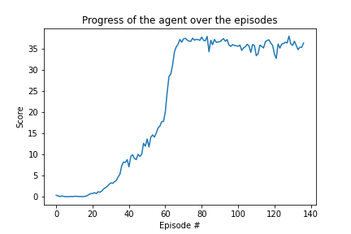

# Project 2: Continuous Control (Report)

This project trains 20 agents in parallel for controlling their arms, such that the agents must be able to reach and go along with a moving ball.

### Learning Algorithms:

I used Deep Deterministic Policy Gradients (DDPG) as underlying learning algorithms for training the agent. The implementation is hugely inspired from pendulum implementation provided in udacity deep-reinforcement-learning repo. In essence the program maintains two types of neural networks , actor and critic. The actor network produces action values corresponding to input states , which can help choose best action , while the critic can take that value and produce continuous value for the action taken.What's important  here is  that it takes the good part of both worlds, value based methods and policy gradient methods, and makes them work together in an synchronous way.  The implementation is in line with ddpg algirithm described in the nanodegree course.

### Chosen Hyperparameters:

Below are the hyper parameters which are used in this project:
 

BUFFER_SIZE = int(1e5)  &nbsp;&nbsp;&nbsp;&nbsp;&nbsp;&nbsp;&nbsp;&nbsp;# replay buffer size  
BATCH_SIZE = 128       &nbsp;&nbsp;&nbsp;&nbsp;&nbsp;&nbsp;&nbsp;&nbsp;# minibatch size 
GAMMA = 0.99            &nbsp;&nbsp;&nbsp;&nbsp;&nbsp;&nbsp;&nbsp;&nbsp;# discount factor 
TAU = 1e-3              &nbsp;&nbsp;&nbsp;&nbsp;&nbsp;&nbsp;&nbsp;&nbsp;# for soft update of target parameters 
LR_ACTOR = 1e-4        &nbsp;&nbsp;&nbsp;&nbsp;&nbsp;&nbsp;&nbsp;&nbsp;# learning rate of the actor  
LR_CRITIC = 1e-4       &nbsp;&nbsp;&nbsp;&nbsp;&nbsp;&nbsp;&nbsp;&nbsp;# learning rate of the critic 
WEIGHT_DECAY = 0        &nbsp;&nbsp;&nbsp;&nbsp;&nbsp;&nbsp;&nbsp;&nbsp;# L2 weight decay  

### Architecture of Neural Network Used:

The actor netowrk has three layers: 
 
— First layer : input size = 33 and output size = 256  
— Second layer : input size = 256 and output size = 128 
— Third layer : input size = 128 and output size = 4 
 

The critic network has following layers: 
 
— First layer : input size = 33 and output size = 256 
— Second layer : input size = 256 + 4 and output size = 128 
— Third layer : input size = 128 and output size = 1 

We use ReLU activation functions for both of the networks.
 

### Plot of Rewards:

In our experiment , the environment is solved in 136 episodes.

Saved Model: [actormodel.pth](actormodel.pth)

### Ideas for Future Work:

Solving the same problem with D4PG algorithm and comparing it against current implementation.

Solving single agent problem with DDPG, ( I did try to implement it , but it appears , it needs lot of hyperparameter tuning to reach to stable convergence.) and  could compare this method to other policy based methods, such as A2C, taking advantage of the parallelisation of different agents.

